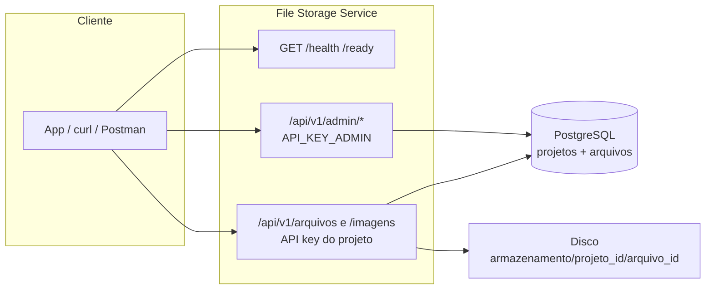

# File Storage Service

**Um microserviço de armazenamento de arquivos reutilizável, pensado para substituir uploads duplicados em múltiplos sistemas.**

É um serviço HTTP em **Rust** (Axum) no estilo **mini S3 interno**: você sobe e baixa arquivos por API, com metadados no **PostgreSQL** e **objetos no disco** — sem depender de um bucket na AWS, mas com a **mesma ideia** de IDs estáveis, URLs e isolamento por projeto. Ideal quando várias aplicações precisam da mesma peça de infraestrutura de upload.

---

## Por que existe este projeto

Sou desenvolvedor júnior e, ao longo do tempo, fui criando **várias aplicações**. Em cada uma havia **o seu próprio jeito** de guardar arquivos: código duplicado, abordagens diferentes, e em **cada projeto novo** eu acabava fazendo **melhor** do que no anterior. O resultado era clássico: o sistema antigo **continuava funcionando** (mais ou menos), **sem manutenção**, porque “entregava” — mas **de um jeito mais improvisado** do que eu gostaria de admitir.

Concluí que fazia mais sentido ter **um único lugar** responsável por uploads e armazenamento: um **microserviço** que **centraliza** isso e atende **todas as aplicações atuais** e as **que ainda vierem**. Este repositório é essa aposta.

O código está **open source** por duas razões: **ajudar quem estiver** na mesma situação e **convidar quem quiser** a sugerir melhorias, corrigir bugs ou evoluir funcionalidades — **portas abertas**.

---

## O que este serviço resolve

- **Elimina código duplicado** de upload em cada projeto.
- **Centraliza o armazenamento** (um só lugar para operar e monitorar).
- **Permite reutilização** entre sistemas, linguagens e times de forma uniforme.
- **Facilita a evolução futura**: trocar disco por **S3**, **CDN**, políticas de retenção, etc., sem reescrever cada app.

---

## Multi-tenant

Cada **projeto** (tenant):

- **Possui sua própria API key** — gerada na criação e usada nas rotas de dados (`/api/v1/arquivos`, `/api/v1/imagens`).
- **Tem isolamento de arquivos** — armazenamento em `{armazenamento}/{projeto_id}/{arquivo_id}`, sem misturar blobs de um projeto com outro no disco.
- **Não acessa dados de outros projetos** — listagem, download e exclusão sempre filtram por `projeto_id`; uma chave não enxerga o que pertence a outro tenant.

Não existe API key global: cada projeto recebe a sua `api_key` na criação.

---

| Área                                                       | Autenticação / observação                                              |
| ---------------------------------------------------------- | ---------------------------------------------------------------------- |
| **Rotas de dados** (`/api/v1/arquivos`, `/api/v1/imagens`) | `Authorization: Bearer <api_key do projeto>`                           |
| **Rotas admin** (`/api/v1/admin/*`)                        | `Authorization: Bearer <API_KEY_ADMIN>`                                |
| **Prefixo das rotas de API**                               | `/api/v1`                                                              |
| **Saúde** (fora do prefixo)                                | `GET /health` e `GET /ready` — sem autenticação                        |

---

## Arquitetura

| Camada             | Papel                                                                                         |
| ------------------ | --------------------------------------------------------------------------------------------- |
| **API HTTP**       | **Axum** — rotas versionadas, multipart, limites de corpo.                                    |
| **PostgreSQL**     | Metadados (projetos, arquivos, tipos MIME, tamanhos).                                         |
| **Disco**          | Armazenamento físico dos blobs por projeto.                                                 |
| **Autenticação**   | **API key por projeto** nas rotas de dados; **chave admin** (`API_KEY_ADMIN`) só para gestão de projetos. |

---

## Diagrama (visão geral)



Fluxo típico: **admin cria projeto** → resposta inclui **`api_key`** → o cliente usa essa chave em **uploads e downloads**.

---

## Stack

| Tecnologia / comportamento              | Detalhe                                                |
| --------------------------------------- | ------------------------------------------------------ |
| **Rust**, **Axum**, **tokio**, **sqlx** | Postgres + migrações em `migrations/`                  |
| Upload                                  | Limite configurável por variável de ambiente           |
| Download                                | Stream (adequado para arquivos grandes)                |

---

## Pré-requisitos

| Requisito                              | Observação                                                                 |
| -------------------------------------- | -------------------------------------------------------------------------- |
| Rust (toolchain estável) e **Cargo**   | —                                                                          |
| **PostgreSQL** e banco criado          | Veja o exemplo SQL abaixo                                                  |
| **sqlx-cli** (opcional)                | `cargo install sqlx-cli --no-default-features --features native-tls,postgres` |

```sql
CREATE DATABASE file_storage;
```

---

## Arranque rápido

```bash
cp .env.example .env
# Ajuste DATABASE_URL, API_KEY_ADMIN, etc.

sqlx database create   # se precisar
sqlx migrate run
cargo run
```

| Item               | Valor padrão / nota                                      |
| ------------------ | -------------------------------------------------------- |
| URL do servidor    | `http://localhost:3000` (ou `PORTA` no `.env`)           |
| Documentação extra | [`docs/USO.md`](docs/USO.md)                             |

---

## Variáveis de ambiente (resumo)

| Variável                       | Função                                                                      |
| ------------------------------ | --------------------------------------------------------------------------- |
| `DATABASE_URL`                 | Conexão PostgreSQL                                                          |
| `DIRETORIO_ARMAZENAMENTO`      | Pasta raiz no disco (ex.: `./armazenamento`)                                 |
| `PORTA`                        | Porta HTTP (padrão `3000`)                                                  |
| `API_KEY_ADMIN`                | Chave **somente** para `/api/v1/admin/*` — criar/listar/apagar projetos     |
| `TAMANHO_MAXIMO_ARQUIVO_BYTES` | Limite por upload (padrão **100 MiB**)                                      |
| `BASE_URL`                     | Opcional; usado no campo `url` das respostas de upload                      |

---

## Como criar um projeto e obter a API key

1. Defina `API_KEY_ADMIN` no `.env` (e o mesmo valor no Postman em `tokenAdmin`, se usar a coleção).
2. Faça **POST** autenticado com essa chave:

```http
POST /api/v1/admin/projetos
Authorization: Bearer <API_KEY_ADMIN>
Content-Type: application/json

{"nome":"Nome do projeto"}
```

3. A resposta **201** devolve JSON com:

| Campo         | Significado                                            |
| ------------- | ------------------------------------------------------ |
| **`id`**      | UUID do projeto                                        |
| **`nome`**    | Nome enviado no corpo                                  |
| **`api_key`** | Chave para `/api/v1/arquivos` e `/api/v1/imagens`      |

Exemplo mínimo com **curl** (substitua `ADMIN_KEY` e `BASE`):

```bash
export BASE=http://localhost:3000
export ADMIN_KEY='admin-chave-local-trocar'

curl -sS -X POST "$BASE/api/v1/admin/projetos" \
  -H "Authorization: Bearer $ADMIN_KEY" \
  -H "Content-Type: application/json" \
  -d '{"nome":"Meu projeto"}'
```

Copie o **`api_key`** do JSON para usar como `PROJETO_KEY` nos próximos pedidos.

Listar projetos (admin):

```bash
curl -sS "$BASE/api/v1/admin/projetos" \
  -H "Authorization: Bearer $ADMIN_KEY"
```

---

## Exemplos curl (projeto já criado)

```bash
export PROJETO_KEY='<cole aqui a api_key do projeto>'
export ARQUIVO_ID='<uuid retornado no upload>'
```

| Ação               | Observações                                                |
| ------------------ | ---------------------------------------------------------- |
| **Upload**         | Multipart, campo obrigatório `arquivo`                     |
| **Listar**         | Lista apenas arquivos do projeto autenticado               |
| **Download**       | Usa `ARQUIVO_ID` retornado no upload                       |
| **Imagem**         | Validação de tipo; mesmo campo `arquivo`                   |
| **Apagar projeto** | Admin; resposta **200** com JSON do projeto removido       |

**Upload** (multipart, campo obrigatório `arquivo`):

```bash
curl -sS -X POST "$BASE/api/v1/arquivos" \
  -H "Authorization: Bearer $PROJETO_KEY" \
  -F "arquivo=@/caminho/arquivo.pdf"
```

**Listar** arquivos do projeto:

```bash
curl -sS "$BASE/api/v1/arquivos" \
  -H "Authorization: Bearer $PROJETO_KEY"
```

**Download**:

```bash
curl -sS -OJ "$BASE/api/v1/arquivos/$ARQUIVO_ID" \
  -H "Authorization: Bearer $PROJETO_KEY"
```

**Imagem** (validação de tipo; mesmo campo `arquivo`):

```bash
curl -sS -X POST "$BASE/api/v1/imagens" \
  -H "Authorization: Bearer $PROJETO_KEY" \
  -F "arquivo=@/caminho/foto.png"
```

**Apagar projeto** (admin; resposta **200** com dados do projeto removido):

```bash
curl -sS -X DELETE "$BASE/api/v1/admin/projetos/$PROJETO_ID" \
  -H "Authorization: Bearer $ADMIN_KEY"
```

---

## Postman

Importe a coleção em [`postman/FileStorege.postman_collection.json`](postman/FileStorege.postman_collection.json).

| Variável                  | Uso                                                                              |
| ------------------------- | -------------------------------------------------------------------------------- |
| `baseUrl`                 | Ex.: `http://localhost:3000`                                                     |
| `tokenAdmin`              | Igual a `API_KEY_ADMIN` no servidor                                              |
| `token`                   | API key **do projeto** (o POST “criar projeto” pode preencher automaticamente)   |
| `projetoId` / `arquivoId` | IDs para rotas com path                                                          |

Ordem sugerida: **Saúde** → **Admin** → **POST criar projeto** (preenche `token`) → **Arquivos** / **Imagens**.

No separador **Authorization** do Postman pode aparecer “No Auth”: o Bearer costuma estar no separador **Headers** (`Authorization: Bearer {{tokenAdmin}}` ou `{{token}}`).

---

## Saúde (sem autenticação)

| Método | Rota      | Descrição                               |
| ------ | --------- | --------------------------------------- |
| GET    | `/health` | Liveness                                |
| GET    | `/ready`  | Readiness (verifica PostgreSQL)         |

---

## Licença

Este projeto está sob a [**MIT License**](LICENSE). Você pode usar, modificar e distribuir o código, mantendo o aviso de copyright e a licença nos derivados.

Antes de colocar em **produção**, revise políticas de segurança, segredos (`API_KEY_ADMIN`, chaves de projeto), rede e HTTPS.
